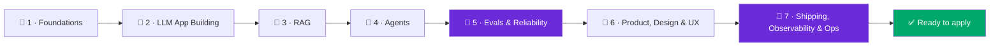

**The 2026 path to the "PM who ships" — build AI-native features end-to-end, with measurable reliability, not demos.**

*Maintained by [Landed](https://landed.jobs) — daily AI-native job matches, agent help with every application, and mock-interview prep.*

---

An **AI Product Engineer** is a *product engineer for probabilistic systems* — someone who owns a feature end-to-end **and** builds the AI itself. The definition that's crystallising in 2026 (Daniel Bentes, *["The AI Product Engineer"](https://medium.com/@danielbentes/the-ai-product-engineer-0f02d7f08590)*) names **three traits**: (1) **ownership of the full loop** on probabilistic systems — where "it works" is a *statistical claim that needs measurement*, not a green checkmark; (2) **evaluation engineering as a first-class discipline**, ranked by an evidence hierarchy — **production telemetry > controlled evals > staged tests > demos**; and (3) **AI-assisted execution** as the operating model. The last trait is the tell: this is the role PMs and full-stack engineers are converging into, and the bar is *shipping measured reliability*, not a slide.

| Role | Ships | Probabilistic? | Product sense | Needs an ML PhD? |
|---|---|---|---|---|
| 🧩 **AI Product Engineer** | An AI-native feature, end-to-end, with a **measured** success rate | Yes (core) | Yes (core) | No |
| 🤖 **AI Engineer** | A working AI feature on foundation models (APIs, RAG, agents) | Yes | Low–med | No |
| 🔬 **ML Engineer** | Models, training pipelines, inference | Often | Low | Often |
| 🛠️ **Full-Stack Engineer** | A deterministic web/mobile app | No | Med–high | No |

> ⭐ **Star this repo** — it's a living, quarterly-refreshed roadmap: 7 stages, 56+ typed & license-noted resources, 5 portfolio projects, and a readiness check that tells you when to apply.

## Contents

- [The AI Product Engineer stack (2026), by layer](#the-ai-product-engineer-stack-2026-by-layer) — the signature tool map
- [The 7-stage roadmap](#the-7-stage-roadmap) — one summary + deep-link per stage
- [Portfolio projects](#portfolio-projects) — ship 4–5 artifacts, not 100 notebooks
- [Are you ready to apply?](#are-you-ready-to-apply) — the readiness check
- [What's new (2026-07)](#whats-new-2026-07)
- [FAQ](#faq)
- [The Landed family](#the-landed-family)
- [Contributing](#contributing)

---

## The AI Product Engineer stack (2026), by layer

The canonical, license-checked map of the tools an AI Product Engineer actually reaches for. **You do not learn all of these** — learn *one per layer you touch*, deeply; the mental model transfers, the API is a weekend. Full annotations, docs links, and licenses in **[tools.md](tools.md)**.

| Layer | Named OSS tools (pick one) | Docs | License |
|---|---|---|---|
| 🧩 **Orchestration** | **LangChain** · LlamaIndex · DSPy · LiteLLM | [langchain](https://python.langchain.com) · [llamaindex](https://docs.llamaindex.ai) · [dspy](https://dspy.ai) | MIT / MIT / Apache-2.0 |
| 🤝 **Agents** | **LangGraph** · OpenAI Agents SDK · MCP · LiveKit Agents · Pipecat | [langgraph](https://langchain-ai.github.io/langgraph/) · [agents-sdk](https://openai.github.io/openai-agents-python/) · [mcp](https://modelcontextprotocol.io) | MIT / MIT / MIT |
| 🧪 **Eval** | **DeepEval** · RAGAS · Evidently · Phoenix | [deepeval](https://deepeval.com/docs/getting-started) · [ragas](https://docs.ragas.io) · [evidently](https://docs.evidentlyai.com) | Apache-2.0 (all) |
| 🔭 **Observability** | **Langfuse** · Arize Phoenix · OpenTelemetry GenAI | [langfuse](https://langfuse.com/docs) · [phoenix](https://arize.com/docs/phoenix) · [otel](https://opentelemetry.io/docs/specs/semconv/gen-ai/) | MIT / Apache-2.0 / Apache-2.0 |
| 🗄️ **Vector DB** | **pgvector** · Qdrant · Chroma · Weaviate · Milvus | [pgvector](https://github.com/pgvector/pgvector) · [qdrant](https://qdrant.tech/documentation/) · [chroma](https://docs.trychroma.com) | PostgreSQL / Apache-2.0 / Apache-2.0 |
| 🚀 **Deploy & serve** | **vLLM** · BentoML · Modal | [vllm](https://docs.vllm.ai) · [bentoml](https://docs.bentoml.com) · [modal](https://modal.com/docs) | Apache-2.0 / Apache-2.0 / proprietary |
| 🎛️ **Fine-tune** | **Unsloth** · HF TRL · Axolotl | [unsloth](https://docs.unsloth.ai) · [trl](https://huggingface.co/docs/trl) · [axolotl](https://docs.axolotl.ai) | Apache-2.0 (all) |

> [!TIP]
> **Build-it, then use-it.** Before you `pip install` a framework, hand-write the 40-line version (a bare RAG loop, a bare tool-calling loop, an error-analysis pass on 50 traces). You'll understand *what the framework hides* and debug it far faster when it leaks.

---

## The 7-stage roadmap

Each stage is a one-concept-per-file mini-lecture with senior traps, interview angles, and a typed & annotated resource list. Start at Stage 1; the ladder is cumulative.

**[🧱 Stage 1 — Foundations →](roadmap/1-foundations.md)**
An LLM is *not a function*: same input, different output; finite working memory you pay for by the token; latency that scales with what it writes. The mechanical model — prefill vs decode, tokens as the unit of everything, the context window as scarce ordered memory — that makes every later stage make sense. You need enough of the model layer to reason about it, **not** an ML PhD.

**[🔧 Stage 2 — LLM App Building →](roadmap/2-llm-app-building.md)**
Turn a raw model into a reliable feature: prompting that survives edits, structured outputs as a *contract* (Pydantic schemas, constrained decoding), the system prompt as a versioned artifact, and the cost/latency levers (prompt caching, streaming, output-token discipline) that separate a demo from a product.

**[🔎 Stage 3 — RAG →](roadmap/3-rag.md)**
Ground the model in trusted data so answers are *right* and *cited*: chunking, embeddings, hybrid search (dense + BM25), re-ranking, and retrieval evals (recall@k, MRR, faithfulness). RAG is the default answer to "how do we make it know our data" — freshness, citations, and access control, no retraining.

**[🤝 Stage 4 — Agents →](roadmap/4-agents.md)**
The harness is the product. An agent is a bounded call→observe→act loop, not a smarter chatbot: tool design as a public API (poka-yoke schemas, structured errors), the workflow-vs-agent decision, single-vs-multi-agent (who owns the write?), recovery stacks, MCP, and the security threat model (the lethal trifecta, prompt injection).

**[🧪 Stage 5 — Evals & Reliability →](roadmap/5-evals-and-reliability.md)**
Eval is the new system design. Turn "looks right" into a number you can gate CI on: error analysis on real traces, capability vs regression evals, trajectory grading (not just the answer), `pass^k` over `pass@k`, and an LLM judge you can actually trust (binary, cross-family, human-calibrated). The eval set built from real failures is the most valuable artifact you own.

**[🎨 Stage 6 — AI Product, Design & UX →](roadmap/6-ai-product-design-ux.md)**
Design for a *failure profile*, not a happy path: define "done" distributionally, match capability tier and autonomy to the cost of a wrong output, treat refusals and empty states as brand moments, and design calibrated-trust UX (honest mental model, provenance, control primitives). The product sense that makes this an *AI Product Engineer* role, not just an AI Engineer one.

**[🚀 Stage 7 — Shipping, Observability & Ops →](roadmap/7-shipping-observability-ops.md)**
Close the loop, leading with **observability** (it sits *above* controlled evals in the evidence hierarchy): span-level traces of every decision/cost/failure on the live distribution, cost-per-resolved-task as the earliest regression signal, the online→offline eval loop, shadow→canary rollout, deploy/serve, latency levers, MCP as a trust boundary, context engineering, and fine-tuning-for-product (last, not first).

---

## Portfolio projects

**Ship 4–5 artifacts, not 100 notebooks.** Employers hire on *evidence that you shipped a measured probabilistic system* — so **every project must include an eval and observability layer** (that's the differentiator between an AI Product Engineer and a tutorial-follower). Full briefs — Problem · Stack · Milestones · Proof artifact — in **[projects/README.md](projects/README.md)**:

1. 🔎 **Chat-with-my-docs** — RAG + observability (LlamaIndex + pgvector/Qdrant + Langfuse)
2. 🎙️ **Real-time voice agent** — interruption handling + tool call + fallback (LiveKit/Pipecat + Phoenix)
3. 🧠 **MCP-powered second brain** — an MCP server exposing your notes/calendar to Claude/Cursor
4. 🧪 **Production-style eval suite** — DeepEval + RAGAS + GitHub Actions catching a model-swap regression
5. 🎛️ **Fine-tuned specialized model** — Unsloth/TRL on domain data, with a before/after eval + model card

---

## Are you ready to apply?

Don't guess. The **[readiness-check.md](readiness-check.md)** is a per-stage "can you…" self-assessment plus the key questions a hiring loop will actually ask — framed as a single question: *are you ready to apply?* Work the roadmap, tick the boxes, then get **referred** instead of applying cold.

---

## What's new (2026-07)

- 🆕 **Stage 7 — Shipping, Observability & Ops** added, leading with observability per the evidence hierarchy (production telemetry > controlled evals > staged tests > demos).
- 🆕 **Portfolio projects** rewritten as 5 briefs, each requiring an eval + observability artifact.
- 🆕 **Readiness check** — per-stage checkboxes + a hiring-loop question bank.
- 🔁 **2026 framing throughout:** reasoning models, MCP as table-stakes (and a trust boundary), agentic/trajectory eval, context engineering, `pass^k`, and "eval is the new system design."
- 📊 **Tool stack refreshed** with current licenses and approximate 2026 star counts.

---

## FAQ

**AI Product Engineer vs AI Engineer — what's the difference?**
An AI Engineer builds a working AI feature (RAG, agents, evals). An **AI Product Engineer owns the product outcome *and* builds the AI** — they decide *what* to ship (product sense, UX, "done" defined distributionally) *and* ship it with a measured reliability bar. Same technical core as an AI Engineer, plus product judgment. It's the "PM who ships."

**Do I need an ML PhD?**
No. You're building *products on top of* foundation models, not training them. You need enough of the model layer to reason about behaviour (prefill/decode, tokens, context, why "works" is a statistical claim) — a mechanical mental model, not a research one. Demonstrated projects beat credentials.

**How long does the roadmap take?**
For someone who already codes (Python + some TypeScript/React): roughly **3–6 months** part-time to work all 7 stages and ship the 4–5 portfolio projects. The stages are cumulative — don't skip evals (Stage 5) or observability (Stage 7); they're exactly what separates you from the tutorial pile.

**What projects prove readiness?**
The 5 in [projects/](projects/README.md) — but the load-bearing detail is that **each ships an eval and an observability artifact** (a Langfuse trace with a faithfulness score, a CI eval-on-PR badge, a before/after eval). A deployed demo *with a measured success rate* beats ten notebooks.

**Which tools should I learn first?**
One per layer you'll touch, in this order for most people: an **orchestration** framework (LangChain or LlamaIndex), a **vector DB** (start with **pgvector** — no new infra), an **eval** tool (DeepEval), and an **observability** tool (Langfuse). Learn them by building, not by reading star counts. See [tools.md](tools.md).

**Is "AI Product Engineer" a real 2026 role?**
Yes. It has a working definition (Daniel Bentes, Feb 2026), real job posts (e.g. PostHog's "AI Product Engineer"), and a clear hiring signal — product-led companies (Linear, Vercel, Cursor and their peers) want people who ship AI features end-to-end. See the live [AI Product Engineer job list](https://github.com/landedjobs/ai-product-engineer-jobs).

---

## Related

Part of the [Landed](https://landed.jobs) AI-native job-search family:

- 🧭 [awesome-ai-native-jobs](https://github.com/landedjobs/awesome-ai-native-jobs) — the umbrella that maps the whole AI-native job landscape
- 🔥 [whos-hiring-in-ai](https://github.com/landedjobs/whos-hiring-in-ai) — real hiring posts from founders on X, sorted by role
- 💸 [recently-funded-ai-startups-hiring](https://github.com/landedjobs/recently-funded-ai-startups-hiring) — fresh-capital startups staffing up now
- 🚀 [ai-engineer-jobs](https://github.com/landedjobs/ai-engineer-jobs) — 300 live AI engineer roles, auto-updated
- 🤝 [forward-deployed-engineer-jobs](https://github.com/landedjobs/forward-deployed-engineer-jobs) — FDE & customer-facing engineering
- 📈 [gtm-engineer-jobs](https://github.com/landedjobs/gtm-engineer-jobs) — GTM engineering roles
- 🎓 [ai-fellowships-and-residencies](https://github.com/landedjobs/ai-fellowships-and-residencies) — 75 fellowships, residencies & programs
- 📘 [ai-interview-guides](https://github.com/landedjobs/ai-interview-guides) — 33 company interview guides
- ❓ [ai-interview-questions](https://github.com/landedjobs/ai-interview-questions) — 331 real interview questions with answers
- 🧪 [projects-to-land-an-ai-job](https://github.com/landedjobs/projects-to-land-an-ai-job) — portfolio projects that actually get you hired
- 📦 [ai-engineer-portfolio-projects](https://github.com/landedjobs/ai-engineer-portfolio-projects) — 80+ buildable portfolio projects

---

## Contributing

PRs and issues welcome — add a resource, fix a stale link, sharpen a stage. Every link must be **typed, annotated, capped, and license-noted**; we ship **MIT** and adapt only MIT/Apache/CC0 (with attribution). See **[CONTRIBUTING.md](CONTRIBUTING.md)**.

---

### Stop spraying. Get **matched**, get **prepped**, get **Landed**.

Maintained by [Landed](https://landed.jobs) · No affiliation with the companies named. Content MIT-licensed.

 

